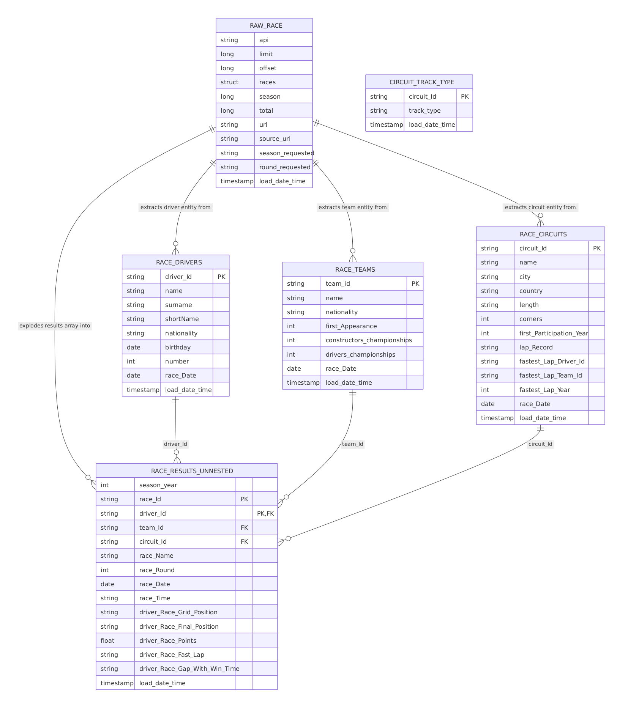
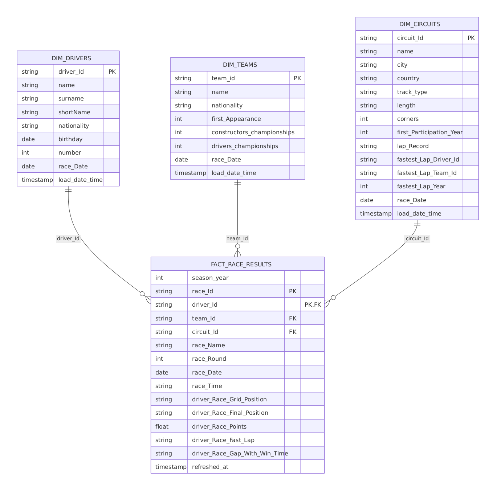
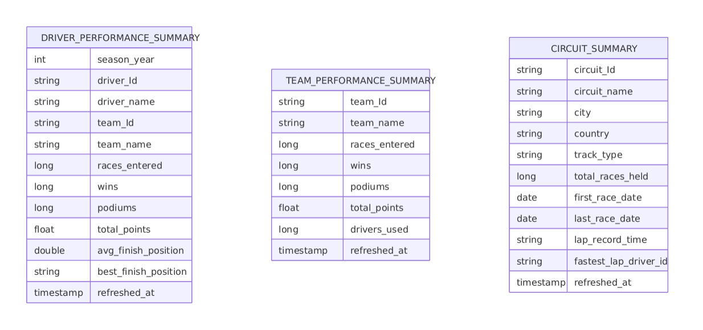

# f1-glue-sdp

An F1 racing analytics pipeline built on **AWS Glue 6.0 Spark Declarative Pipelines
(SDP)** -- a port of an existing Databricks Lakeflow Declarative Pipelines
implementation of the same use case, adapted to [AWS Glue's declarative-pipeline
framework](https://docs.aws.amazon.com/glue/latest/dg/spark-declarative-pipelines.html)
and its constraints.

## Architecture

```
F1 API (f1api.dev)                        Static CSVs in S3
      │  one HTTP GET per run                   │  deployed by CDK at synth
      │  (live, external source)                │  time -- never fetched live
      ▼                                          ▼
┌─────────────────────── bronze (streaming tables) ───────────────────────────────┐
│ raw_race → race_results_unnested        circuit_track_type                      │
│                  ├→ race_drivers        (independent branch -- no dependency    │
│                  ├→ race_teams           on raw_race; its own streaming table   │
│                  └→ race_circuits ───┐   over flat files, not an API)           │
└───────────────────────────────────────┼─────────────────────────────────────────┘
                                         ▼  joined on circuit_Id
┌──────────────────────── curated (materialized views, SCD1) ─────────────────────┐
│ dim_drivers · dim_teams · dim_circuits (+track_type) · fact_race_results         │
│ (latest row per key via ROW_NUMBER() -- no SCD2/history; Glue SDP has no         │
│  create_auto_cdc_flow/APPLY CHANGES primitive)                                  │
└───────────────────────────────────────────────────────────────────────────────┘
      ▼
┌──────────────────────── gold (materialized views) ──────────────────────────────┐
│ driver_performance_summary · team_performance_summary · circuit_summary(+track_type) │
└───────────────────────────────────────────────────────────────────────────────┘
```

All of this runs as **one Glue 6.0 job** with SDP enabled -- the framework infers the
full dependency graph (including the two independent bronze branches above, which
converge only at `dim_circuits`) purely from table references in
`pipeline_src/transformations/`, with no separate orchestration resource. See
[Multiple data sources, zero orchestration](#multiple-data-sources-zero-orchestration)
below for why `circuit_track_type` exists.

Key differences from the Databricks original (see `pipeline_src/f1_pipeline_lib/` and
`pipeline_src/transformations/` for the full rationale in code comments):

- **Bronze calls the F1 API directly** (`f1_pipeline_lib/extract.py`), instead of a
  separate ingestion notebook dumping JSON files for an Auto Loader stream to read.
- **No SCD Type 2.** AWS Glue 6.0 SDP has no CDC/MERGE/upsert primitive (confirmed from
  the official docs: only streaming tables and materialized views exist as writable
  dataset types). All four curated tables are **SCD Type 1** (latest-state-only),
  resolved via a `ROW_NUMBER()` window function over the full bronze history.
- **No quarantine/data-quality layer in v1** (deferred). A malformed API response or
  network failure simply fails the job run; re-run it.

### Entity-relationship diagrams

Per-layer table shapes and relationships:

- **Bronze** -- `raw_race` (API) and `circuit_track_type` (flat files) are
  unconnected here; they're independent bronze roots.

  

- **Curated** -- `dim_circuits` carries `track_type`, joined in from
  `circuit_track_type`; the two bronze roots converge here.

  

- **Gold** -- three standalone summary tables, no FKs between them, each
  aggregated straight from curated.

  

## Multiple data sources, zero orchestration

`circuit_track_type` (street / permanent / hybrid, a classification not present in the
F1 API payload at all) is a second, fully independent bronze source, deliberately
heterogeneous from `raw_race` in every way that matters:

| | `raw_race` | `circuit_track_type` |
|---|---|---|
| Source type | Live external API | Static flat files in S3 |
| Delivered by | A `requests.get()` inside the flow, each run | `scripts/deploy.sh --upload-reference-data` (opt-in, not part of `cdk deploy`) |
| Ingestion mechanism | S3-staging workaround (API payload has no natural streaming shape) | Direct `spark.readStream` over a watched S3 directory |
| Table dependency | None -- it's the root of the graph | None -- an independent root, not downstream of `raw_race` |

They converge for the first time at `dim_circuits` (`pipeline_src/transformations/03_curated.sql`), via a single `JOIN circuit_track_type` clause. That one line is the *entire* mechanism: AWS Glue SDP discovers the new upstream dependency purely by scanning table references in `transformations/`, schedules `circuit_track_type`'s branch independently and in parallel with `raw_race`'s, and resolves the combined DAG automatically -- no Step Functions, no Airflow, no second job, no manifest-level wiring beyond the SQL join itself.

`reference_data/` (repo root, a sibling of `pipeline_src/` -- not nested inside it) is deliberately **not** part of the CDK stack's own code/asset bundling -- `cdk deploy` never reads from that folder, so it can't accidentally ship stray local files (e.g. `.DS_Store`) to S3. It does write one tiny `circuit_track_type/.keep` marker on every deploy (with `prune: false`, so it can never delete real data) purely so the streaming table's watched S3 directory exists even before any real CSVs have been uploaded -- otherwise the very first run after a fresh deploy would fail with the same `[PATH_NOT_FOUND]` error `raw_race`'s bronze-staging path once hit. Run `scripts/deploy.sh ... --upload-reference-data` to sync the real `*.csv` files to `s3://<bucket>/<prefix>/reference-data/` (see [Deploy](#deploy) below for customizing the destination prefix).

Because `circuit_track_type` is a genuine streaming table (not a materialized view), adding a second CSV file under `reference_data/circuit_track_type/` and re-running `--upload-reference-data` causes the next job run to ingest only the new file, not reprocess the first -- confirmed via the Spark streaming checkpoint's own file-offset log on a real run.

## Repo layout

| Path | What |
|---|---|
| `app.py`, `cdk.json` | CDK entrypoint, context-driven naming/sizing knobs |
| `f1_glue_sdp/` | The one CDK stack (S3 bucket, IAM role, Glue database, Glue job) |
| `pipeline_src/spark-pipeline.yml` | SDP manifest template (Iceberg + Glue Catalog config, `libraries:` glob list) |
| `pipeline_src/_sys_path_bootstrap.py` | Makes `f1_pipeline_lib` importable for every transformation file, in one place -- see its docstring for why this can't just be inlined once in `f1_pipeline_lib/__init__.py` |
| `pipeline_src/f1_pipeline_lib/` | Plain Python (no `pyspark.pipelines` import) -- HTTP fetch + schema. Independently unit-testable. |
| `pipeline_src/transformations/` | The SDP pipeline itself: bronze streaming tables (incl. the explode/flatten logic, which lives here rather than in `f1_pipeline_lib/` since it's only ever called once per table and needs an active SDP graph context anyway), curated/gold materialized views |
| `reference_data/` | Static flat files for the second, independent bronze source (see above); lives at the repo root, outside `pipeline_src/`, and **not** part of the CDK stack -- synced to S3 only via `scripts/deploy.sh --upload-reference-data`, never shipped inside the job's code zip |
| `scripts/` | Deploy, destroy, package, and run-a-race helpers |
| `tests/` | CDK infra assertions, packaging tests, and `f1_pipeline_lib`/reference-data unit tests |

## Setup

```bash
python3 -m venv .venv
source .venv/bin/activate   # or `source .venv/Scripts/activate.bat` equivalent on Windows via source.bat
pip install -r requirements.txt -r requirements-dev.txt
```

Running `f1_pipeline_lib`'s tests locally needs **Java 17+** (Glue 6.0 runs Spark 4.1.1,
which requires it) -- e.g. `brew install openjdk@17` and point `JAVA_HOME` at it.

Run the test suite:

```bash
pytest tests/
```

## Deploy

```bash
scripts/deploy.sh --profile <your-aws-profile> --bootstrap   # --bootstrap only needed once per account/region
```

`cdk.json`'s `context` block pins the bucket name/suffix, prefix, database, and job
name so re-synthesizing doesn't change them. Override any of them per-run with
`-c key=value -- ` appended to `deploy.sh`, e.g.:

```bash
scripts/deploy.sh --profile my-profile -- -c environment_tag=prod
```

A plain deploy never reads from `reference_data/` -- that's deliberate (see
[Multiple data sources, zero orchestration](#multiple-data-sources-zero-orchestration)).
It does write a tiny `.keep` marker so `circuit_track_type`'s streaming read
doesn't fail with `[PATH_NOT_FOUND]` before any real data exists; to sync the
actual CSVs to S3, add the flag:

```bash
scripts/deploy.sh --profile <your-aws-profile> --upload-reference-data
```

By default this syncs the whole `reference_data/` folder to
`s3://<bucket>/<stack-prefix>/reference-data/` -- the path `spark-pipeline.yml`'s
`spark.f1.reference.circuit_track_type.path` already points at. Two flags narrow
that down independently:

- `--reference-data-source <path>` -- upload one specific `.csv` file or
  subdirectory instead of the whole folder. Relative paths resolve against the
  repo root. A directory is synced (`--delete`, so it stays an exact mirror of
  that folder); a single file is copied on its own and never deletes anything
  else already at the destination.
- `--reference-data-prefix <prefix>` -- destination S3 key prefix, same bucket,
  instead of `<stack-prefix>/reference-data`.

Combine them to stage one specific file at one specific prefix, e.g. to push
just the incremental-load demo file on its own:

```bash
scripts/deploy.sh --profile <your-aws-profile> --upload-reference-data \
  --reference-data-source reference_data/circuit_track_type/incremental_load.csv \
  --reference-data-prefix f1-pipeline/reference-data/circuit_track_type
```

If you use a custom prefix, update `spark.f1.reference.circuit_track_type.path`
in `pipeline_src/spark-pipeline.yml` to match -- these flags only control what
gets uploaded and where, not where the Glue job reads from.

## Run a race

Bronze pulls exactly one race (one `season`/`round`) per job run -- same granularity
as the Databricks original. Populating more history means repeated runs with
different values.

```bash
# Dry run: checks dependency/SQL/Python compilation, writes no data. Also skips the
# live F1 API call entirely (bronze reads spark.glue.sdp.jobMode and short-circuits
# the fetch during VALIDATE), so this never hits f1api.dev.
scripts/run_pipeline.sh --profile <your-aws-profile> --season 2024 --round 1 --mode validate --wait

# Real run
scripts/run_pipeline.sh --profile <your-aws-profile> --season 2024 --round 1 --mode run --wait

# Another race, to see the pipeline accumulate history
scripts/run_pipeline.sh --profile <your-aws-profile> --season 2024 --round 2 --mode run --wait

# Force a full recompute of one dataset (e.g. after a logic change)
scripts/run_pipeline.sh --profile <your-aws-profile> --season 2024 --round 1 --full-refresh dim_drivers
# ...or everything
scripts/run_pipeline.sh --profile <your-aws-profile> --season 2024 --round 1 --full-refresh-all
```

## Verify

```bash
aws glue get-tables --database-name f1_sdp_db --profile <your-aws-profile> \
  --query 'TableList[].Name'
```

Then query via Athena, e.g.:

```sql
SELECT * FROM f1_sdp_db.raw_race;
SELECT COUNT(*) FROM f1_sdp_db.race_drivers;
SELECT * FROM f1_sdp_db.driver_performance_summary ORDER BY wins DESC LIMIT 10;

-- The second, independent bronze source and its join into curated/gold:
SELECT * FROM f1_sdp_db.circuit_track_type;
SELECT circuit_Id, country, track_type FROM f1_sdp_db.dim_circuits;
SELECT * FROM f1_sdp_db.circuit_summary;
```

## Teardown

```bash
scripts/destroy.sh --profile <your-aws-profile>
```

The bucket uses `auto_delete_objects`, so Iceberg warehouse data and SDP checkpoint
state are deleted along with the stack.

## Known limitations (v1)

- No quarantine/data-quality layer -- a bad API response or parse failure fails the
  whole job run rather than being routed anywhere. Deferred; revisit later.
- No multi-race/season backfill -- one run processes exactly one race.
- No SCD Type 2 / history tracking on dimensions (see Architecture above).
- `circuit_track_type` is append-only (a streaming table) -- correcting an existing
  row means adding a new one, not editing in place; the curated-layer join dedupes
  by latest `load_date_time`, the same convention used for the API-sourced dimensions.
