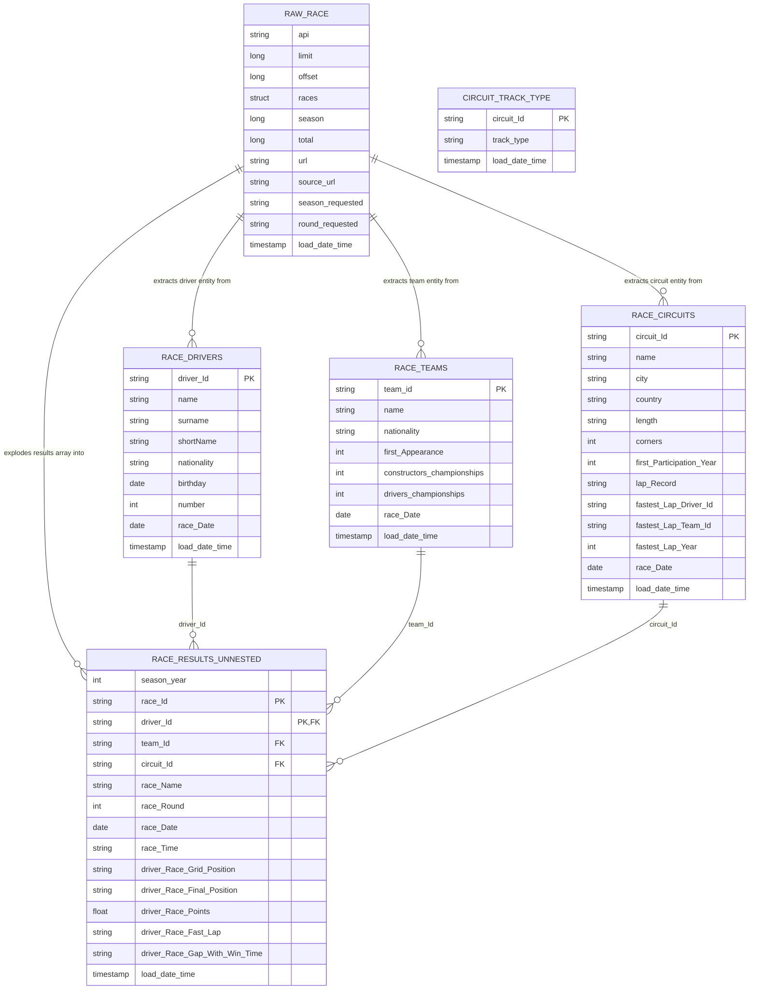

# Bronze layer -- ER diagram

Source: `pipeline_src/transformations/00_bronze_circuit_track_type.py`,
`01_bronze_raw.py`, `02_bronze_prepared.py`.

`circuit_track_type` is deliberately drawn with no relationship to `raw_race` --
it's the second, independent, non-API source described in the main README's
"Multiple data sources, zero orchestration" section. It only becomes related to
the rest of the graph in the curated layer, via its join into `dim_circuits`.

