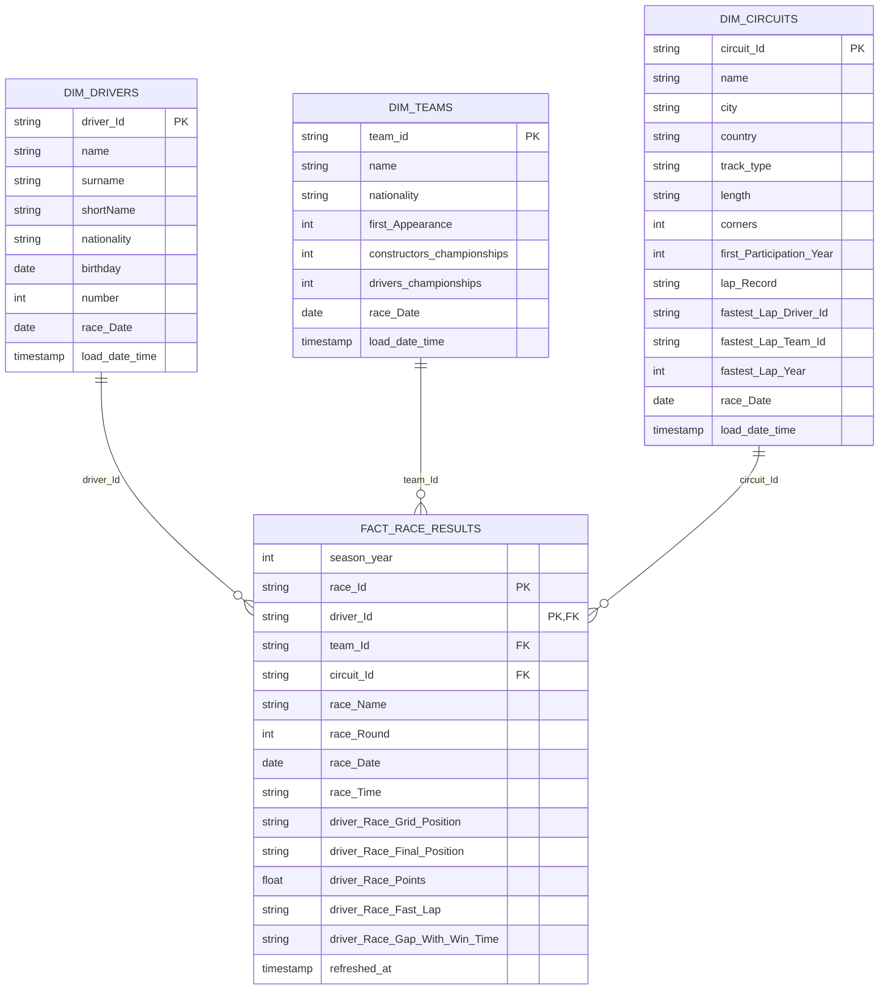

# Curated layer -- ER diagram

Source: `pipeline_src/transformations/03_curated.sql`.

All four tables are SCD Type 1 (latest-state-only, via `ROW_NUMBER()` -- see the
file's header comment) -- there is no `__START_AT`/`__END_AT` history here,
unlike the Databricks original this project was ported from: AWS Glue 6.0 SDP
has no `create_auto_cdc_flow`/APPLY CHANGES primitive.

`dim_circuits` carries `track_type`, joined in from the second, independent
bronze source `circuit_track_type` (see the bronze-layer diagram) -- that join
is the entire mechanism proving SDP auto-infers a second DAG branch with zero
orchestration config.

