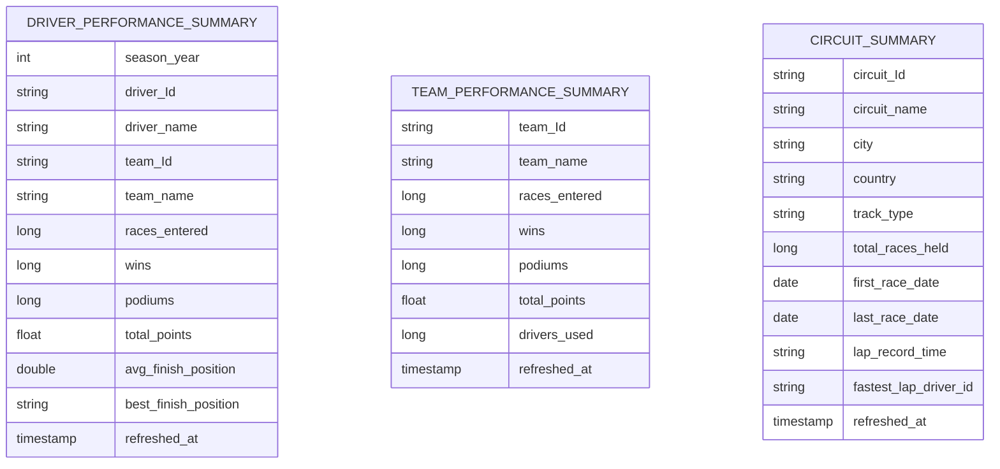

# Gold layer -- ER diagram

Source: `pipeline_src/transformations/04_gold.sql`.

Three fully denormalized, standalone summary tables -- no foreign keys between
them (matching the Databricks original's gold layer shape), each aggregated
straight from the curated layer's `fact_race_results` joined to its relevant
dimension(s). `circuit_summary` carries `track_type` through from
`dim_circuits`, proving the second bronze source's data reaches all the way to
gold.

